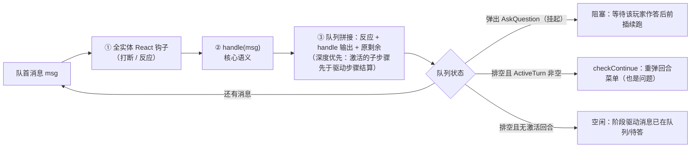
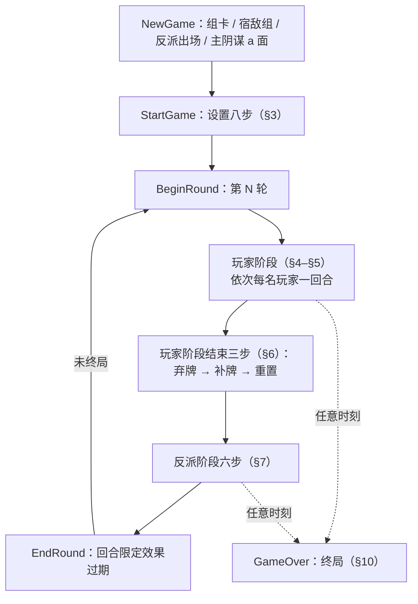
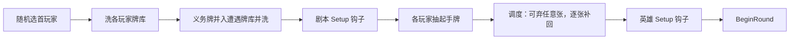
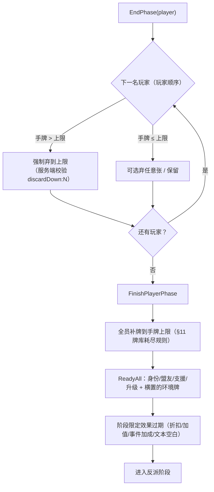
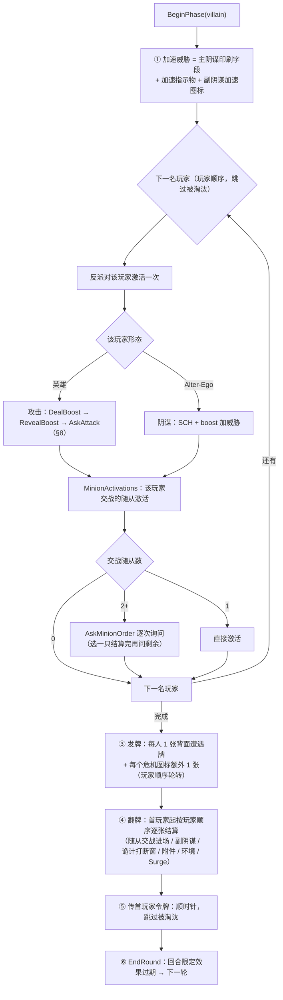
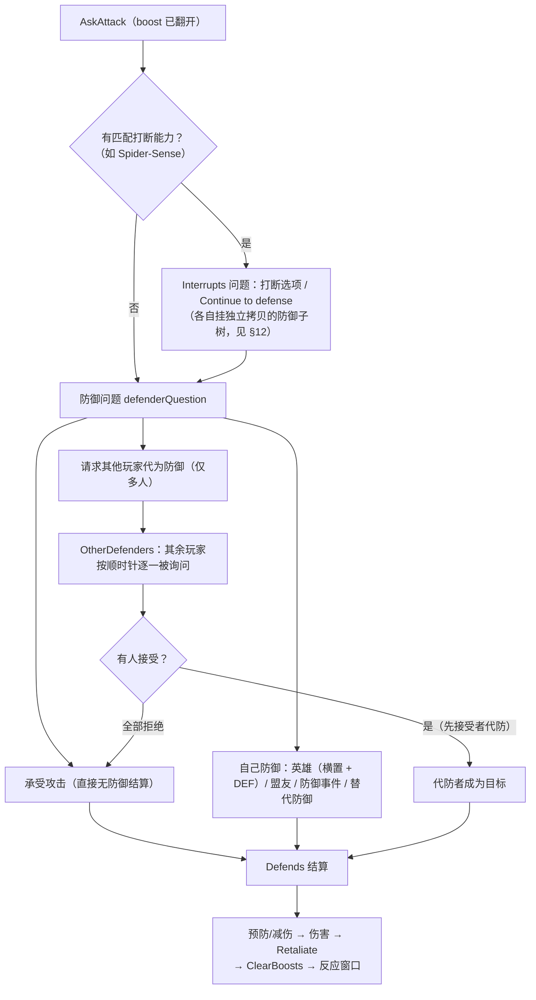
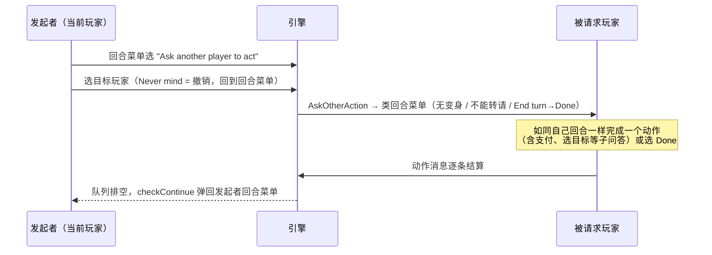
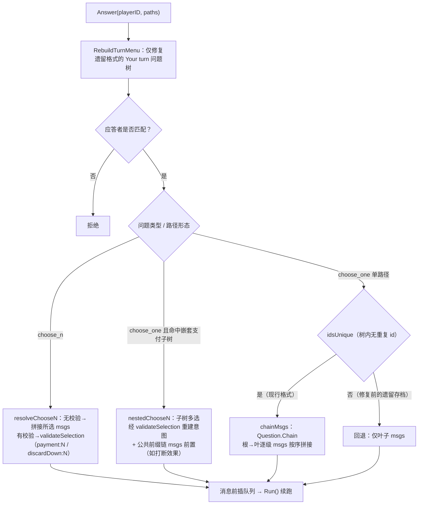

# 游戏引擎流程 / Game Engine Flow

> 状态：2026-08-23，与 `main` 分支当前实现一致（规则对齐于 Rules Reference v1.7）。
> 本文描述引擎如何驱动一局游戏：架构模型、设置、回合结构、各阶段步骤、
> 应答协议与关键文件索引。

## 1. 总体架构

引擎是**消息驱动的队列状态机**，三个核心概念：

| 概念 | 位置 | 说明 |
|---|---|---|
| 消息队列 | `Game.queue` | 游戏推进的唯一载体；每个消息触发实体反应与核心处理 |
| 挂起问题 | `Game.pending` | 一次只阻塞在**一个**问题上，问题只面向一名玩家；答后续跑 |
| 行为注册表 | `cards/*` 的 `init()` | 卡牌逻辑（能力/反应/费用钩子）按卡牌 code 注册，状态只存数据 |

随机性是 `(Seed, Counter)` 的纯函数（`game.go: Random`），队列与问题树只携带
可序列化数据，因此整个 `Game` 可 JSON 存档并在恢复后无缝续跑。

单条消息的处理次序（`game.go` 的 `Run` → `process`）：

要点：handle 的输出被插到队列**最前**，所以"反派激活"消息派生的 boost/伤害/
询问步骤总在同阶段后续驱动消息之前完整结算——这就是整个引擎的时序骨架。

## 2. 一局的生命周期

## 3. 设置阶段（handle.go `handleStartGame`，对齐官方 Appendix II）

细节：

- **首玩家**：官方为"玩家共同决定"，实现为种子随机（保持可复现），记日志。
- **调度**（`ResolveMulligan`/`MulliganCard`）：保留 / 弃任意张再抽回等量。
- 主阴谋在 `NewGame` 已以 a 面出场并排队翻到 b 面（a 面 Setup 效果先结算）。

## 4. 回合结构与玩家阶段

`BeginRound`：Round+1，清 `UsedThisRound`/`AllyPlayedThisRound`，进入
`BeginPhase{PhasePlayer}`。

玩家阶段：`UsedThisTurn` 清空，`TurnIndex` 定位到首玩家（被淘汰则顺延），
`PlayerTurnStart` 开始其回合（清 FormChanged/EndedTurn、记 ActiveTurn）。
每名玩家回合结束后 `PlayerTurnEnd` 找下一名**未结束且未淘汰**的玩家；全部
结束 → `EndPhase{PhasePlayer}`。

**重要**：抽牌与重置不在回合开始，而在玩家阶段**结束时**（官方 End of Player
Phase）。因此反派阶段里玩家是"满手牌、全重置"的状态——可以横置英雄/盟友
防御、打出防御事件。

## 5. 玩家回合菜单（turn.go `turnMenu(p, ownTurn=true)`）

队列排空时 `checkContinue` 按 `ActiveTurn` 重新弹出。选项（任意次序、任意
次数，费用允许即可）：

| 选项 | 说明 |
|---|---|
| 变身 | 每回合一次、仅本人回合；横置状态保持不变 |
| 出手牌 | 盟友/支援/升级/事件/玩家副阴谋；带费走支付子问题（§12） |
| 弃牌堆盟友 | Lockjaw 类 |
| 激活能力 | 身份/盟友/支援/升级；门槛见 `Ability.usable` |
| 请求其他玩家行动 | 仅多人局（§9） |
| 基础能力 | 英雄攻击/阻碍（选目标）、alter-ego 恢复、随从攻击/阻碍（含后果伤害） |
| End turn | → `PlayerTurnEnd` |

目标限制：**Guard**——有守卫随从交战时不能攻击无守卫字样的反派；**危机**——
场上有危机副阴谋时主阴谋不可阻碍，危机副阴谋本身可被阻碍。

## 6. 玩家阶段结束三步

## 7. 反派阶段（handle.go `handleBeginPhase{PhaseVillain}`，官方六步）

随从激活同样按目标玩家形态决定攻击/阴谋（无 boost 牌）；眩晕/混乱分别取消
攻击/阴谋激活并消耗状态。

## 8. 攻击结算：boost、防御、代防、打断

**boost**：`DealBoost`（背面发一张）→ `RevealBoost`（星号能力先结算、图标数
计入 BoostCount，"进场"型 boost 直接进场）→ 结算后 `ClearBoosts`。

攻击询问在 boost 翻开后构建（`AskAttack`，显示的攻击值含加成）：

打断分支被选中时，其效果沿路径聚合**先于**防御结算（打断 → 防御的完整语义，
见 §12）。

## 9. 请求其他玩家行动（AskOtherAction）

菜单构建时临时把 ActiveTurn 指向被请求者（保证攻击/阻碍目标、支付、
RunAbility 计数落在其名下），构建后立即还原。ActiveTurn 全程属于发起者，
因此"恰好一个动作后自动交还"由架构天然保证，无需模式标记。

## 10. 淘汰与胜负

- **玩家淘汰**（combat.go `eliminatePlayer`）：身份 HP≤0 且无救援钩子 → 淘汰
  而非全队失败：其盟友/支援/升级弃掉、手牌与背面遭遇牌清空、交战随从移交
  下一顺时针玩家、持令牌则顺延、挂起问题作废并结束其回合。**全员**淘汰才失败。
- **失败**：主阴谋威胁达标（剧本钩子可改写，如推进阶段）或全员淘汰。
- **胜利**：反派最终阶段被击败（`advanceVillainStage`：越阶段清伤害，同/异
  名阶段的附件/状态延续规则已区分）。

## 11. 牌库耗尽

- **玩家牌库**（`DrawCards`）：抽牌途中牌库空 → 洗弃牌堆成新牌库，并立即给
  自己发一张背面遭遇牌（下次翻牌步骤结算）；牌库与弃牌堆同空则抽不出。
- **遭遇牌库**（combat.go `drawEncounter`）：重洗弃牌堆时主阴谋获得一个加速
  指示物（下一反派阶段第 1 步生效）。

## 12. 应答协议（问题树与链聚合）

问题树 = `Question`（choose_one / choose_n）+ `Choice`（叶上挂消息载荷
`msgs`，或 `Then` 子问题）；子树 id 由根统一赋全路径前缀（"2.0"）。
**WithThen 深拷贝**：多个选项挂同一子问题对象时（如防御子问题）各自持有
独立拷贝，分支 id 命名空间互不串扰。

`Answer(playerID, paths)` 的分派：

客户端（web/src/views/Game.tsx）下钻子树后以**叶全路径**作答；choose_n 多选
一次提交全部路径。服务端校验应答者身份后才将消息前插队列续跑。

## 13. 关键文件索引

| 文件 | 内容 |
|---|---|
| `internal/engine/game.go` | Game 状态、Run/process 循环、Answer、支付校验 |
| `internal/engine/handle.go` | 全部消息语义：设置、阶段驱动、激活、防御、代防、请求行动 |
| `internal/engine/turn.go` | 回合菜单、防御/攻击询问、Guard/危机过滤、支付问题构建 |
| `internal/engine/combat.go` | 伤害/治疗/威胁/状态、牌库、淘汰 |
| `internal/engine/question.go` | 问题树（id 赋号、Chain、WithThen 拷贝、遗留回退） |
| `internal/engine/message.go` + `codec.go` | 消息类型与序列化信封（新消息需注册） |
| `internal/engine/entities.go` / `player.go` | 实体与玩家状态、数值计算 |
| `internal/engine/ability.go` | 能力模型与使用门槛 |
| `internal/engine/scenario.go` | 剧本定义与钩子 |
| `internal/engine/cards/*` | 各扩展包卡牌行为注册 |
| `internal/engine/rules_test.go` | 主循环规则回归测试 |
